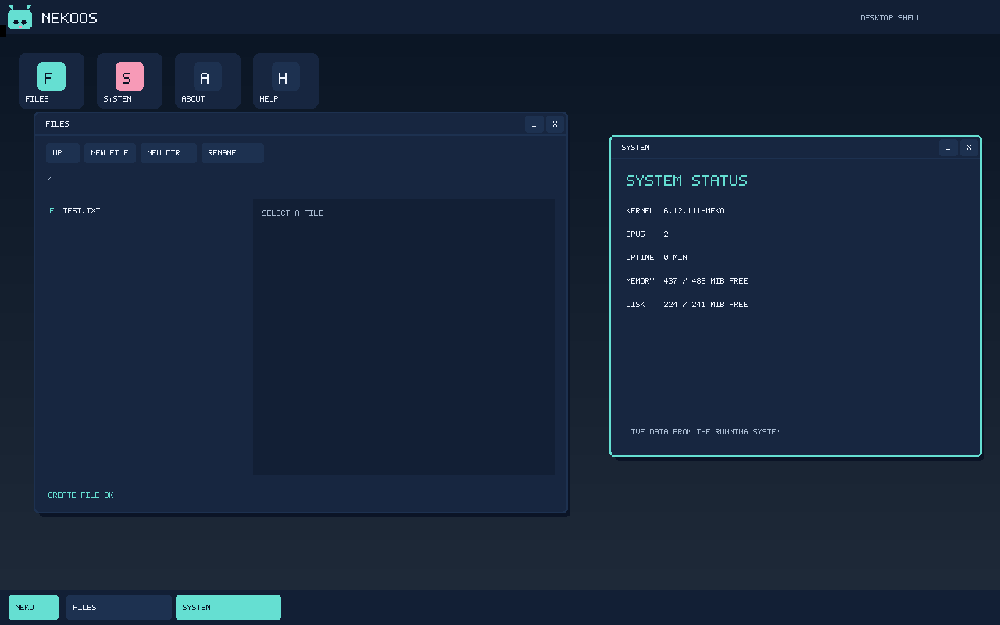

# NekoOS

Минимальная Linux-based ОС для x86_64. Уже загружается в QEMU до консоли
`neko#`: Linux 6.12.111 + статический BusyBox 1.37.0. Доступна загрузка
из initramfs или с отдельного виртуального системного диска.
В образ включены `sh`, компилятор C TinyCC 0.9.27 и musl 1.2.6 с заголовками.
BusyBox и TinyCC собраны с musl; программы, созданные внутри NekoOS,
тоже используют её.
Теперь есть виртуальный диск для пользовательских файлов. Это среда для
разработки базовой системы, пока без полноценного рабочего стола и установки
на физический диск.
Виртуальная сеть доступна по флагу `--net`. С флагом `--graphics` в QEMU
запускается первая оконная оболочка: рабочий стол, панель, окна Files, System,
About и Help. Это пока один графический процесс с прямым выводом в framebuffer;
в этом режиме отдельные графические приложения ещё предстоит добавить. Для
перехода к полноценному рабочему столу в образ уже входят Xorg, библиотеки
X11, GLib/GObject/GIO, Cairo,
libxfce4util, движок шрифтов FreeType, Fontconfig, масштабируемые шрифты
DejaVu и пользовательская шина D-Bus. Это зависимости будущего рабочего
стола, а не сам рабочий стол. В QEMU отдельные Xlib-программы создают окна;
первый оконный менеджер evilwm работает в X11-сеансе по флагу `--x11`.
**GTK 3, компоненты рабочего стола Xfce и Thunar пока не установлены.**
Обычный запуск `--graphics` по-прежнему открывает прежнюю оконную оболочку.

## Быстрый старт

В Ubuntu / Debian x86_64, в обычной учётной записи Linux:

```bash
git clone https://github.com/Kuislij/NekoOS.git ~/src/NekoOS
cd ~/src/NekoOS
bash scripts/bootstrap-dev.sh --install
bash os check
bash os build
bash os test --no-build
bash os run
```

Для сборки нужны Linux filesystem, несколько ГБ свободного места и интернет
при первом скачивании исходников. На Windows используйте WSL2; не собирайте
в `/mnt/c` или `/mnt/f`. По умолчанию сборка использует 4 потока, например
`JOBS=2 bash os build` уменьшает нагрузку. Root для сборки не нужен.

В подготовленной среде этого проекта откройте PowerShell:

```powershell
wsl -d Ubuntu -u neko --cd /home/neko/src/NekoOS
```

Затем `bash os run`. При первом запуске создаётся виртуальный диск на 512 МиБ
в `out/disks/state.img` внутри Linux-копии проекта. Приглашение `neko#`
означает, что можно вводить команды. Например:

```sh
echo Привет > ~/hi
cat ~/hi
poweroff
```

После следующего `bash os run` команда `cat ~/hi` снова покажет `Привет`.
При запуске shell открывается в `/root`, так что файл `hi` без `~/` тоже
сохранится. Сохраняются `/root`, `/home`, `/var/lib` и `/usr/local`;
файлы в `/tmp` и изменения системных каталогов вроде `/etc` в обычном режиме
исчезают после выключения. Режим `--system` сохраняет и системные каталоги.
`neko-help` показывает ещё несколько примеров. Штатное выключение —
`poweroff`. Для экстренного выхода из QEMU: **Ctrl+A, затем X**; после него
лучше проверить файловую систему при следующем запуске, как после внезапного
отключения питания. По умолчанию сетевая карта к VM не подключена;
физические диски и общие папки не подключаются никогда.

### Системный раздел на диске

Для загрузки с отдельного виртуального ext4-диска внутри QEMU запустите:

```bash
bash os run --system
```

При первом запуске появится отдельный `out/disks/system.img` на 256 МиБ.
Маленький загрузочный образ найдёт его и передаст управление системе на диске.
Существующий `out/disks/state.img` остаётся вторым диском: ваши файлы в
`/root`, `/home`, `/usr/local` и `/var/lib` доступны в обоих режимах. В режиме
`--system` изменения `/etc` и основной части `/usr` тоже переживают выключение.
Например, в консоли `neko#`:

```sh
echo готово > /etc/neko/notice
poweroff
```

После нового `bash os run --system` выполните `cat /etc/neko/notice`.
Обычный `bash os run` продолжает загружать систему из initramfs и не показывает
изменения её `/etc`. Сборка сама не перезаписывает существующий `system.img`.
Чтобы перенести новую сборку на уже созданный системный диск, выключите VM и
выполните в Linux-копии проекта:

```bash
bash os system-update
```

Команда сначала обновит временную копию, проверит её файловую систему и
загрузку, а затем переключит рабочий диск. Она выведет имя резервной копии
`system-backup-...img` в `out/disks/`. Для отката после выключения VM:

```bash
bash os system-rollback system-backup-YYYYMMDDTHHMMSSZ-XXXXXXXX.img
```

Подставьте точное имя, которое вывело обновление. `state.img` с `/root`,
`/home`, `/var/lib` и `/usr/local` при обновлении и проверке не подключается.
Существующие изменения `/etc` сохраняются; если новое значение отличается,
оно доступно рядом как файл `.neko-new` для ручного сравнения. Системные
программы в `/usr` обновляются; собственные программы размещайте в
`/usr/local`. Ручные правки системных файлов в `/usr` остаются в резервной
копии старого диска, но не переносятся поверх новой версии. Не удаляйте
резервную копию, пока не проверите новую систему. Режим `--system` нельзя
сочетать с `--ram`; через BIOS и GRUB он запускается командой
`bash os run --iso --system`.

### Локальные программы и службы

Программы в `/usr/local/bin` сохраняются на виртуальном диске и доступны
по имени команды после следующей загрузки. Для проверки в `neko#`:

```sh
printf '#!/bin/sh\necho NekoOS\n' > /usr/local/bin/hello-neko
chmod +x /usr/local/bin/hello-neko
hello-neko
neko-service list
neko-service list --all
neko-service status network
```

После `poweroff` и нового `bash os run` команда `hello-neko` по-прежнему
работает. При загрузке BusyBox init запускает `neko-service`: сначала
встроенные службы, затем включённые локальные. Сетевая служба включена по
умолчанию; `neko-service disable network` отключит её при следующей загрузке,
а `neko-service enable network` включит обратно. Ручные `start|stop|restart`
действуют сразу и не меняют автозапуск. `list --all` показывает также
отключённые службы. Настройки автозапуска сохраняются только при запуске с
виртуальным диском; режим `--ram` не принимает `enable` и `disable`.

Собственную службу можно положить на сохраняемый диск:

```sh
cat > /usr/local/etc/neko/services/hello <<'EOF'
#!/bin/sh
case "$1" in
  start) echo hello >> /var/lib/hello-service.log ;;
  status) test -f /var/lib/hello-service.log && echo 'hello: started' ;;
  stop) : ;;
  *) exit 2 ;;
esac
EOF
chmod +x /usr/local/etc/neko/services/hello
neko-service enable hello
poweroff
```

После следующего `bash os run` проверьте `cat /var/lib/hello-service.log`.
`neko-service disable hello` остановит её **автозапуск** со следующего раза;
текущий процесс при необходимости остановите `neko-service stop hello`.
Для долгоживущей программы служба может отдать управление процессом самой
NekoOS. Добавьте в её скрипт отдельную строку `# neko-service: foreground`, а
в действии `run` запускайте программу через `exec` без `&`. Тогда команды
`neko-service start|status|stop|restart ИМЯ` отслеживают процесс, записывают
его вывод в `/run/neko/services/ИМЯ.log` и могут штатно остановить его:

```sh
cat > /usr/local/etc/neko/services/ticker <<'EOF'
#!/bin/sh
# neko-service: foreground
case "$1" in
  run) exec sleep 600 ;;
  *) exit 2 ;;
esac
EOF
chmod +x /usr/local/etc/neko/services/ticker
neko-service enable ticker
neko-service start ticker
neko-service status ticker
neko-service stop ticker
```

Скрипты служб запускаются от root, поэтому добавляйте только доверенный код.
Ошибка запуска отдельной службы выводит `SERVICE_FAILED:имя`, а консоль остаётся
доступной; `neko-service status имя` показывает сбой текущей загрузки.
В обычном режиме основная часть `/usr` и `/etc` приходит из initramfs;
в режиме `--system` — с отдельного системного диска.

### Пакеты

NekoPkg устанавливает программы в сохраняемый `/usr/local`.
В консоли `neko#` попробуйте встроенный пример:

```sh
neko-pkg info /usr/share/nekoos/packages/neko-greet-0.1.0.npkg
neko-pkg install /usr/share/nekoos/packages/neko-greet-0.1.0.npkg
neko-greet
neko-pkg upgrade /usr/share/nekoos/packages/neko-greet-0.2.0.npkg
neko-pkg install /usr/share/nekoos/packages/neko-companion-1.0.0.npkg
neko-companion
neko-pkg list
neko-pkg verify neko-greet
neko-pkg remove neko-companion
neko-pkg remove neko-greet
```

Новый NekoPkg/3 переносит вместе с командой файлы программы, например ресурсы
интерфейса. Встроенный пример показывает, что при обновлении команда и ресурс
переходят на одну версию:

```sh
neko-pkg install /usr/share/nekoos/packages/neko-theme-1.0.0.npkg
neko-theme
cat /usr/local/share/neko-theme/message.txt
neko-pkg upgrade /usr/share/nekoos/packages/neko-theme-1.1.0.npkg
neko-theme
neko-pkg verify neko-theme
neko-pkg remove neko-theme
```

Установленная команда работает и после следующего запуска. Если она уже
установлена, повторите `neko-greet` и `neko-pkg list` без новой установки.
Установка требует обычного запуска с виртуальным диском, не `--ram`.
Менеджер отклоняет повреждённый архив, сверяет SHA-256 и не заменяет чужую
команду с тем же именем. Новый формат NekoPkg/2 поддерживает требования к
минимальной версии уже установленного пакета; зависимости сначала ставятся
вручную. `upgrade` переключает команду на новую версию без промежутка,
когда она недоступна. Формат NekoPkg/3 также открывает файлы пакета под
`/usr/local/share/ИМЯ` и `/usr/local/lib/ИМЯ`; обновление переключает их
вместе с командой. Если `neko-greet` уже установлен, начните с `list` и
перейдите к обновлению. Автоматической загрузки зависимостей и сетевых
репозиториев ещё нет.
Как собрать свой пакет и добавить его в образ, описано в
[packages/README.md](packages/README.md).

### Системные пакеты для будущего рабочего стола

Отдельный формат `NSPKG/1` собирает системные компоненты из закреплённых
исходников в `/usr` **на этапе сборки образа**. Архив содержит манифест с
версией, лицензией, исходной контрольной суммой, зависимостями и суммами
файлов. Перед включением проверяются пути, содержимое и конфликты. Это не
пакеты гостевого `neko-pkg`: тот устанавливает пользовательские программы в
сохраняемый `/usr/local` после загрузки.

Сейчас образ включает [Pixman 0.46.4](recipes/pixman/README.md),
[xorgproto 2025.1](recipes/xorgproto/README.md),
[xtrans 1.6.0](recipes/xtrans/README.md),
[libXau 1.0.12](recipes/libxau/README.md),
[libXdmcp 1.1.5](recipes/libxdmcp/README.md),
[libxcb 1.17.0](recipes/libxcb/README.md),
[libX11 1.8.13](recipes/libx11/README.md) и
[libXext 1.3.7](recipes/libxext/README.md), собранные для musl NekoOS.
Для оконных приложений также добавлены
[libXrender 0.9.12](recipes/libxrender/README.md),
[libXfixes 6.0.2](recipes/libxfixes/README.md) и
[libXrandr 1.5.5](recipes/libxrandr/README.md).
Следующий слой уже собран отдельными системными пакетами и подключён к
очереди сборки образа: [zlib 1.3.2](recipes/zlib/README.md),
[libxkbfile 1.2.0](recipes/libxkbfile/README.md),
[xkbcomp 1.5.0](recipes/xkbcomp/README.md),
[xkeyboard-config 2.48](recipes/xkeyboard-config/README.md),
[libfontenc 1.1.9](recipes/libfontenc/README.md),
[libXfont2 2.0.9](recipes/libxfont2/README.md),
[font-misc-misc 1.1.3](recipes/font-misc-misc/README.md),
[libxcvt 0.1.3](recipes/libxcvt/README.md),
[libpciaccess 0.19](recipes/libpciaccess/README.md),
[libdrm 2.4.134](recipes/libdrm/README.md) и
[libsha1 0.3](recipes/libsha1/README.md). Они дают обработку раскладок,
битовые шрифты, режимы экрана, доступ к DRM/PCI и SHA-1 для Xorg.
В образ также вошли [Xorg 21.1.24](recipes/xorg-server/README.md),
[libevdev 1.13.7](recipes/libevdev/README.md),
[mtdev 1.1.7](recipes/mtdev/README.md) и
[xf86-input-evdev 2.11.0](recipes/xf86-input-evdev/README.md).
Первый независимый оконный менеджер — [evilwm 1.5](recipes/evilwm/README.md).
[libffi 3.5.2](recipes/libffi/README.md) и
[PCRE2 10.48](recipes/pcre2/README.md) поддерживают уже собранные
[GLib/GObject/GIO 2.84.4](recipes/glib/README.md) и первую библиотеку
[Xfce — libxfce4util 4.20.1](recipes/libxfce4util/README.md).
Для изображений и шрифтов добавлены
[libpng 1.6.58](recipes/libpng/README.md),
[Expat 2.8.5](recipes/expat/README.md),
[FreeType 2.14.3](recipes/freetype/README.md),
[Fontconfig 2.17.1](recipes/fontconfig/README.md) и
[DejaVu 2.37](recipes/dejavu-fonts/README.md). Для векторной отрисовки
добавлен [Cairo 1.18.6](recipes/cairo/README.md) с PNG- и X11-бэкендами.
[D-Bus 1.16.2](recipes/dbus/README.md) даёт пользовательскую шину:
`neko-x11-session` запускает её от `neko` вместе с Xorg и останавливает при
выходе из сеанса. В одноразовой VM проверяются запуск Xorg на virtio-GPU,
доставка событий клавиатуры и мыши до Xlib-клиента, управление отдельным
окном через evilwm, поиск шрифта, работа новых библиотек и вызов через D-Bus.
xtrans содержит исходные фрагменты транспорта для других компонентов и не
является отдельной разделяемой библиотекой в госте. Xlib и libXext дают
клиентским программам интерфейсы X11, но им нужен запущенный X-сервер.
Зависимости и их минимальные версии проверяются до изменения дерева образа.
На сборочной машине используются закреплённые
[xcb-proto](recipes/xcb-proto/README.md) и [pkgconf](recipes/pkgconf/README.md);
в гостевую систему они не попадают. Проверки в QEMU запускают программы,
связанные с Pixman, libXau/libXdmcp, libxcb, Xlib, libXext и новым
библиотечным слоем. В очередь сборки образа входят 38 системных пакетов
`NSPKG/1`; initramfs содержит 5999 записей. **GTK 3, Xfce и Thunar пока не
установлены**: текущий экран с окнами
Files/System остаётся однопроцессным прототипом. Последовательность перехода
описана в
[ADR-017](docs/adr/0017-system-packages-and-pixman.md) и
[ADR-018](docs/adr/0018-x11-client-foundation.md); новый слой Xlib и
ближайшая проверка Xorg — в [ADR-019](docs/adr/0019-xlib-xext-and-xorg-milestone.md).
Сборка Xorg и его зависимости описаны в
[ADR-020](docs/adr/0020-xorg-server-dependencies.md).
Оконный менеджер и запуск временного X11-сеанса описаны в
[ADR-021](docs/adr/0021-window-managed-x11-session.md).
Новые библиотеки, пользовательская шина и следующий порядок сборки описаны
в [ADR-022](docs/adr/0022-gtk-xfce-foundation.md).

### Сеть

Включите виртуальную сеть при запуске:

```bash
bash os run --net
```

После появления `neko#`:

```sh
neko-net-status
ping -c 1 127.0.0.1
```

Гостевая система получает IPv4-адрес, маршрут и DNS от виртуального DHCP
QEMU. Поддерживаются IPv4, TCP, UDP, ICMP и HTTP-клиент `wget`; сеть работает
также с `bash os run --iso --net` и `bash os run --ram --net`. QEMU использует
сеть пользовательского режима с исходящими подключениями, без открытых
портов для входящих соединений. HTTPS/TLS, IPv6 и обновление DHCP-аренды в
долгих сессиях пока не настроены.

### Загрузка через BIOS и GRUB

Для проверки полного пути загрузки в виртуальной машине соберите ISO и
запустите его с тем же виртуальным диском:

```bash
bash os build
bash os iso
bash os test --iso --no-build
bash os run --iso
```

`bash os run --iso` сам пересобирает ядро и ISO; `bash os iso` использует уже
собранные файлы. В консоли `neko#` команда `neko-boot-status` показывает,
обнаружены ли процессоры, RAM, прерывания, таблицы ACPI, виртуальный диск и
ext4. Обычный ISO загружает систему из initramfs. Для полного пути
BIOS → GRUB → системный диск используйте:

```bash
bash os iso --system
bash os test --iso --system --no-build
bash os run --iso --system
```

Второй образ `NekoOS-system.iso` выбирает пункт системного диска по умолчанию.
В режиме `--system` команды берутся из существующего `system.img`; новый ISO
сам по себе не обновляет программы на этом диске. Для этого используйте
`bash os system-update`.
Оба ISO предназначены для виртуального BIOS в QEMU; это пока не установочные
образы и не образы для UEFI.
Физические диски компьютера не используются.

### Текущий графический прототип

Откройте окно QEMU с текущим графическим прототипом NekoOS:

```bash
bash os run --graphics
```



При наличии `/dev/fb0` служба `desktop` запускается автоматически. На экране
появятся значки Files, System, About, Help и нижняя панель. Щелчок по значку
или кнопке панели открывает окно или выводит его на передний план. Окна можно
перетаскивать за заголовок, сворачивать кнопкой `_` и закрывать кнопкой `X`.
`Tab` переключает окна; `Esc` закрывает текущее окно. Если окон нет, `Esc`
завершает оболочку. Клавиши `F`, `S`, `A`, `H` открывают соответствующие окна.

В Files можно просматривать папки внутри `/home/neko`, открывать краткий
просмотр текстового файла, создавать файл или каталог и переименовывать
обычный файл. Кнопки `UP`, `NEW FILE`, `NEW DIR`, `RENAME` дублируются
клавишами `U`, `N`, `M`, `R`. Стрелки ↑/↓ выбирают запись; `Enter` или →
открывает её, ← поднимается на уровень выше. Для создания файла нажмите
`F`, затем `N`, введите, например, `test.txt` и нажмите `Enter`. Пустой файл
появится в `/home/neko`. При обычном запуске с диском он останется там после
перезагрузки. Ввод имени можно отменить клавишей `Esc`. Сейчас Files не
редактирует содержимое файлов; подробные границы прототипа описаны в
[ADR-015](docs/adr/0015-windowed-desktop-path.md).

Экран рисуется напрямую в framebuffer одним процессом от пользователя `neko`.
В терминале запуска остаётся отдельная консоль `neko#`: через неё можно
проверить `neko-service status desktop`, остановить экран командой
`neko-service stop desktop` и снова запустить через `neko-service start desktop`.
Графического терминала на рабочем столе нет. Без `--graphics` служба
пропускает запуск, поэтому обычная консоль загружается как прежде. Проверка
графического пути без открытия окна: `bash os test --graphics`.
Для системного диска: `bash os test --graphics --system`.

Для запуска с сохраняемого системного диска используйте
`bash os run --system --graphics`. Если `system.img` был создан до появления
экрана, сначала выключите VM и выполните `bash os system-update`, чтобы
перенести новую сборку на этот диск. Окна пока принадлежат одной оболочке,
а не отдельным приложениям. Цель следующего крупного этапа — полный
сеанс Xfce с готовым файловым менеджером Thunar как отдельной
программой. Это [зафиксировано в ADR-016](docs/adr/0016-real-desktop-distribution-strategy.md);
основа системных пакетов описана в
[ADR-017](docs/adr/0017-system-packages-and-pixman.md), а собранные
библиотеки X11 — в [ADR-018](docs/adr/0018-x11-client-foundation.md) и
[ADR-019](docs/adr/0019-xlib-xext-and-xorg-milestone.md).
QEMU уже способен показать такой экран; нынешний упрощённый вид создаёт
сам `neko-desktop`.

Чтобы попробовать **отдельные** процессы Xorg, evilwm и графического окна,
запустите `bash os run --x11`. Сеанс откроется автоматически; после закрытия
приветственного окна вернётся прежняя оболочка. С отдельным системным диском
используйте `bash os run --system --x11` после `bash os system-update`.
Из уже работающей гостевой консоли в режиме `--graphics` тот же сеанс можно
запустить командой
`neko-x11-session`. Это промежуточная демонстрация управления окнами; Xfce и
Thunar пока отсутствуют. Во время этого сеанса работает отдельная
пользовательская шина D-Bus для будущих программ Xfce. Автоматические проверки:
`python3 tools/evilwm_smoke.py` и `python3 tools/x11_autostart_smoke.py`
в Linux-копии проекта.

Курсор в окне QEMU передаётся как абсолютный указатель, без обязательного
захвата мыши. Щёлкните по окну QEMU, чтобы направить туда клавиатуру;
приглашение `neko#` остаётся в терминале. Если ввод не попал в окно,
**Ctrl+Alt+G** переключает захват QEMU
([справка QEMU](https://www.qemu.org/docs/master/system/keys.html)).

### Программа на C внутри NekoOS

Сначала можно собрать готовый пример в консоли `neko#`:

```sh
cc /usr/share/nekoos/examples/hello.c -o hello
./hello
```

Чтобы написать свой вариант, создайте исходный файл и соберите его:

```sh
cat > hello.c <<'EOF'
#include <stdio.h>
int main(void) {
    puts("Hello from NekoOS");
    return 0;
}
EOF
cc hello.c -o hello
./hello
```

`cc` запускает TinyCC. Программа использует заголовок `<stdio.h>` и C-библиотеку
musl. Файлы `hello.c` и `hello` останутся в `/root` после `poweroff`.
Это начальный C toolchain, не полный GCC/Clang и не среда для C++.
Используйте обычную сборку `cc hello.c -o hello`: флаг `-static` в текущей
комбинации TinyCC/musl пока не поддерживается надёжно.

## Команды

| Команда | Результат |
| --- | --- |
| `bash os doctor` | Проверка доступности инструментов |
| `bash os check` | Два теста компилятора, Make/Ninja и старта QEMU |
| `bash os build` | Проверка исходников, сборка ядра, BusyBox, initramfs |
| `bash os image` | Создать виртуальный диск, если его ещё нет; существующие файлы не стирает |
| `bash os system-image` | Создать системный диск из текущей сборки, если его ещё нет |
| `bash os system-update` | Обновить выключенный системный диск после проверки на временной копии |
| `bash os system-rollback ИМЯ` | Вернуть сохранённый системный диск по имени резервной копии |
| `bash os iso` | Создать загрузочный BIOS ISO из уже собранных ядра и initramfs |
| `bash os iso --system` | Создать BIOS ISO с системным диском как пунктом по умолчанию |
| `bash os run` | Сборка и консоль с сохранением файлов |
| `bash os run --system` | Загрузиться с сохраняемого системного ext4-диска |
| `bash os run --graphics` | Открыть окно QEMU с оконным рабочим столом; консоль остаётся в терминале |
| `bash os run --x11` | Открыть X11-сеанс с отдельным оконным менеджером и приложением |
| `bash os run --iso` | Сборка и запуск через виртуальный BIOS и GRUB |
| `bash os run --iso --system` | Загрузиться через BIOS и GRUB с системного диска |
| `bash os run --net` | Включить виртуальную сеть, DHCP и исходящие подключения |
| `bash os run --ram` | Временная консоль без диска; файлы исчезают после выключения |
| `bash os run --verbose` | Сборка и полный вывод ядра при загрузке |
| `bash os test` | Сборка и автоматический тест временной гостевой системы |
| `bash os test --disk` | Две загрузки с проверкой сохранённого файла |
| `bash os test --iso` | Две загрузки ISO через BIOS и GRUB, проверка оборудования и данных |
| `bash os test --iso --system` | Две загрузки системного диска через BIOS и GRUB на временных дисках |
| `bash os test --net` | Проверить DHCP, DNS-настройку, ICMP и HTTP в QEMU |
| `bash os test --services` | Проверить сохранение настроек служб на отдельном временном диске |
| `bash os test --system` | Две загрузки с отдельных временных системного и пользовательского дисков |
| `bash os test --system-update` | Проверить обновление, сохранение настроек и откат на временных дисках |
| `bash os test --graphics` | Проверить экран, пользователя `neko` и графические устройства без окна |
| `bash os test --graphics --system` | Проверить тот же графический путь с временным системным диском |
| `python3 tools/xorg_smoke.py` | Проверить Xorg и доставку реальных событий клавиатуры и мыши до отдельной Xlib-программы в одноразовой VM |
| `python3 tools/evilwm_smoke.py` | Проверить запуск X11-сеанса и управление отдельным окном через evilwm в одноразовой VM |
| `python3 tools/x11_autostart_smoke.py` | Проверить автозапуск и остановку X11-сеанса из initramfs и с системного диска |
| `bash os test --package` | Проверить установку, зависимости, обновление и удаление на отдельном тестовом диске |
| `bash os test --no-build` | Тест уже собранных файлов с проверкой их SHA256 |

Результаты: `out/images/bzImage`, `initramfs.cpio.gz`,
`bootstrap.cpio.gz`, `system-template.img`, `NekoOS.iso`, `NekoOS-system.iso`,
конфигурации и контрольные суммы. Логи: `build/logs/build.log`, `serial.log`,
`boot-test.log`, `disk-test-*.log`, `iso-test-*.log`, `iso-system-test-*.log`,
`network-test.log`, `graphics-test.log`, `services-test-*.log`,
`system-test-*.log`, `package-test-*.log`, `check-dev.log`.
Полный вывод сборки
при `os run` также находится в `run-build.log`. Сборки, кэш, логи и
виртуальные диски исключены из Git. **Не удаляйте `out/disks/state.img` или
`out/disks/system.img`, если нужны сохранённые файлы.** Для резервной копии
сначала выключите VM, затем скопируйте нужный файл целиком.

Перед загрузкой проверяется содержимое initramfs. Тест ждёт `SYSTEM_READY`,
выполняет команды в shell, компилирует и запускает C-программу, проверяет
файловые системы, каталоги и запись в `/tmp`, затем требует успешное выключение.
При успехе выводит `BOOT_TEST_PASSED`; таймаут или ошибка дают ненулевой код.

[Среда и проверки](docs/development.md) · [Файловая система](docs/filesystem.md) ·
[Архитектура](docs/architecture.md) ·
[План](docs/roadmap.md) · [Безопасность](docs/security.md) · [Лицензии](docs/licenses.md)

[Решение о развитии оконного рабочего стола](docs/adr/0015-windowed-desktop-path.md).
[Курс на настоящий рабочий стол из готовых компонентов](docs/adr/0016-real-desktop-distribution-strategy.md).
[Системные пакеты и первая графическая библиотека](docs/adr/0017-system-packages-and-pixman.md).
[Клиентские библиотеки X11 для будущего рабочего стола](docs/adr/0018-x11-client-foundation.md).
[Xlib, libXext и ближайший рубеж Xorg](docs/adr/0019-xlib-xext-and-xorg-milestone.md).
[Минимальный Xorg и отдельный X11-клиент](docs/adr/0020-xorg-server-dependencies.md).
[Первый оконный менеджер и X11-сеанс](docs/adr/0021-window-managed-x11-session.md).
[Библиотечная основа GTK/Xfce и пользовательская шина D-Bus](docs/adr/0022-gtk-xfce-foundation.md).

[Результаты проверок этапов 1–2](docs/validation-2026-09-23.md).
[Результаты проверки этапа 3](docs/validation-2026-09-25.md).
[Проверка сохраняемого диска](docs/validation-persistence-2026-09-25.md).
[Проверка C toolchain](docs/validation-c-toolchain-2026-09-25.md).
[Проверка загрузки через BIOS и GRUB](docs/validation-boot-2026-09-25.md).
[Проверка сети](docs/validation-network-2026-09-25.md).
[Проверка локальных программ и служб](docs/validation-services-2026-09-25.md).
[Проверка сохраняемых служб](docs/validation-persistent-services-2026-09-26.md).
[Проверка системного диска](docs/validation-system-disk-2026-09-26.md).
[Проверка BIOS-загрузки с системного диска](docs/validation-iso-system-2026-09-26.md).
[Проверка единой musl в базовой системе](docs/validation-musl-2026-09-26.md).
[Проверка первого формата пакетов](docs/validation-packages-2026-09-26.md).
[Проверка зависимостей и обновления](docs/validation-package-upgrades-2026-09-26.md).
[Проверка многофайловых пакетов, служб и графических устройств](docs/validation-platform-2026-09-26.md).
[Проверка первого графического экрана и пользователя](docs/validation-desktop-2026-09-27.md).
[Проверка оконного рабочего стола и файлового действия](docs/validation-windowed-desktop-2026-09-27.md).
[Проверка системного пакета Pixman и обновления образа](docs/validation-system-packages-2026-09-27.md).
[Проверка основы X11 и системного обновления](docs/validation-x11-foundation-2026-09-27.md).
[Проверка Xlib, libXext и системного образа](docs/validation-xlib-foundation-2026-09-27.md).
[Проверка Xorg, ввода и отдельного X11-окна](docs/validation-xorg-foundation-2026-09-28.md).
[Проверка оконного X11-сеанса](docs/validation-window-managed-x11-2026-09-28.md).
[Проверка управления указателем QEMU](docs/validation-absolute-pointer-2026-09-28.md).
[Проверка шрифтов, библиотек и D-Bus для Xfce](docs/validation-desktop-dependencies-2026-09-29.md).
