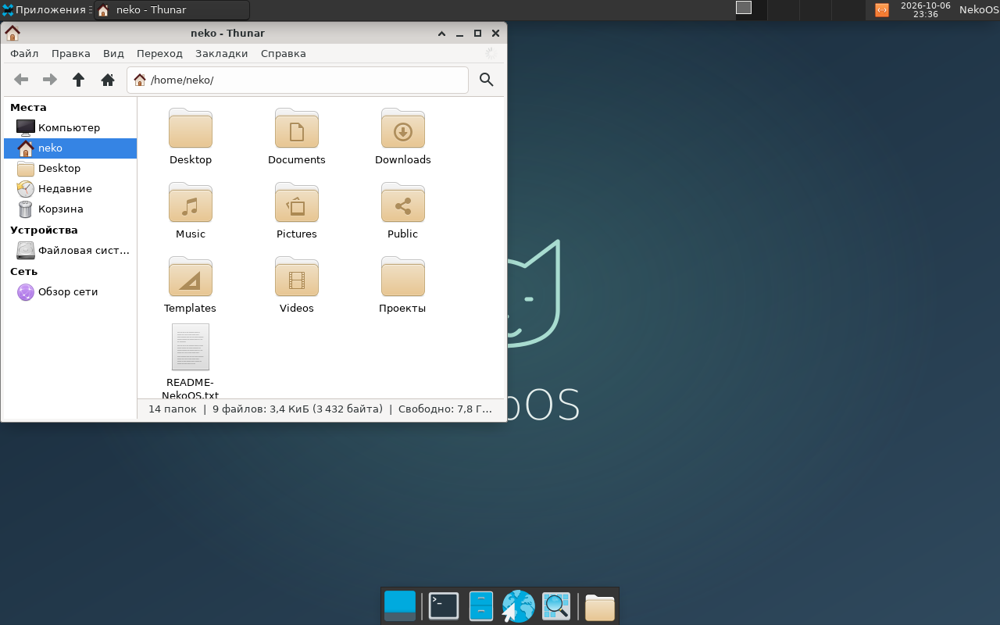

# Проверка первой загрузки и восстановления NekoOS — 2026-10-06

Статус: **пройдено в QEMU**. 91 unit-тест проекта, синтаксис Bash и
Windows-пускателей проверены. На временных поколениях воспроизведены
отсутствующее ядро, неисправный графический вход и аварийное завершение
управляющего процесса. Восстановленный рабочий стол проверен вместе
с файлами, владельцами и настоящими событиями ввода QEMU.

## Конфигурация и данные

Ubuntu WSL на F:, native Linux filesystem `/home/neko/src/NekoOS`, обычный
пользователь `neko`. QEMU q35/KVM, CPU host, 2 vCPU, 2048 МиБ RAM,
virtio-blk/network/VGA, USB keyboard/tablet; SeaBIOS и OVMF без Secure Boot.
Источник — GPT-шаблон с 471 пакетом снимка 2026/09/29 и ядром
`7.2.7-arch1-1`. Системные поколения независимые qcow2; HOME — отдельный
ext4 raw-диск 8 ГиБ. Ошибки вводились в одноразовые копии, пользовательские
диски не подключались к тесту. Временные диски удалены после проверки.

В начале создан UTF-8 файл `/home/neko/Documents/boot-recovery-check.txt`.
После восстановления графики через Thunar создан каталог `after-recovery`
и файл `/home/neko/after-recovery/README.txt`. У обоих проверены владелец
и SHA-256 `92fd501fc1f6e70aa423f3f53afbb945c8c21bb9af2e3ccbf0a6ddbb99cfcca1`;
те же файлы проверены после следующего восстановления и исправного запуска.

## Реальные отказы

| Сценарий | Проверенный результат |
| --- | --- |
| У кандидата убран `/boot/vmlinuz-linux`, запуск BIOS | Первая загрузка не подтверждена, QEMU остановлена; предыдущий корень автоматически выбран и загрузил Xfce с прежним файлом |
| У кандидата masked LightDM, запуск UEFI | Доступность консоли не принята за готовность; предыдущая система загрузила видимые панели, desktop и Thunar, ввод создал каталог |
| Управляющий Python-процесс завершён настоящим SIGKILL после сохранения `booting`; QEMU приостановлена через `-S` | Незавершённая попытка сохранилась; занятый корень отказался открываться, файл состояния побайтно не изменился |
| Тест остановил только свою оставшуюся QEMU, повторный запуск UEFI без сетевого устройства | Сохранённая незавершённая попытка вызвала возврат; оба файла и владельцы сохранились |
| Исправный кандидат, запуск BIOS без сетевого устройства | Рабочий стол подтверждён, кандидат остался активным; предыдущий корень удерживается, `trial` очищен |

В итоговом сценарии 12 запусков QEMU: импорт и проверка HOME, запись файла,
две загрузки для внесения ошибок, две неисправные попытки и два возврата,
приостановленная QEMU при SIGKILL, возврат после прерывания и исправная
первая загрузка. Таймаут неисправных попыток в тесте — 50 секунд;
обычный launcher использует 180 секунд. Автоматически выполняется только
одна попытка возврата; повторный отказ прекращает запуск.

Тестовые кандидаты для внесения отказов — копии рабочего поколения с
намеренно внесённой неисправностью. Этот сценарий проверяет механизм
первой загрузки, а не новое пакетное обновление или смену версии ядра.
Полная транзакция pacman проверяется отдельной регрессией ниже.

Итог и суммы исходников — [машинный отчёт](validation/boot-recovery-2026-10-06.json).
В конце теста сверены SHA-256 настоящих `out/arch/managed/state.json`,
`home.img` и всех системных поколений: они не изменились.

## Регрессии и подключение существующей VM

Повторён полный сценарий `bash os arch update test`: отказ сети, прерывание
реальной ALPM-транзакции, подписанное полное обновление 2026/09/29 →
2026/10/01 на копиях, BIOS/UEFI-проверка кандидата, включение, подтверждение
первой загрузки и ручной откат с текущими файлами. Пакетные суммы до/после
совпадают с [проверкой предыдущего этапа](validation-managed-updates-2026-10-02.md);
ядро остаётся `7.2.7-arch1-1`. Результат —
[машинный отчёт регрессии](validation/managed-update-regression-2026-10-06.json).

После тестов отдельно выполнен Windows-пускатель
`Manage-NekoOS.ps1 -Action verify` для существующей управляемой VM.
Метаданные переведены из формата 1 в 2 при подтверждении рабочего стола;
активное поколение, предыдущий корень и существующий HOME удерживаются.
Гость штатно выключен. Это обычная загрузка настоящего HOME, а не
утверждение о его побайтной неизменности во время работы ОС.
Обычная прежняя VM остаётся отдельно; её SHA-256 и контрольная сумма
предыдущего управляемого корня не изменились. Подробности —
[отчёт существующей VM](validation/managed-boot-user-2026-10-06.json).

## Unit-проверки и пределы

Проверены текущий nonce и отказ устаревшего подтверждения, миграция без
пересоздания дисков, атомарность записи, сохранение HOME, запрет удаления
единственного fallback до подтверждения, повреждённый fallback, отказ хоста,
закрытие окна, отсутствие цикла возврата и отсутствие отката после уже
подтверждённой загрузки. Отдельный shell-тест воспроизводит запуск процесса
Thunar раньше появления окна и проверяет ожидание окна.

Граница результата — первый запуск выбранного поколения через управляемый
launcher VM. Проверка использует serial-autologin; это не монитор всех
последующих сбоев, защита от злонамеренного гостя или восстановление
физических установок. Изменения файлов приложениями до отказа сохраняются;
совместимость всех пользовательских форматов со старой версией не доказана.
Live ISO не пересобирался. Stable-канал, подписанный каталог NekoOS,
несколько зеркал и Secure Boot остаются следующими этапами.

Команды — [инструкция](managed-updates.md), решение —
[ADR-028](adr/0028-first-boot-recovery.md).
