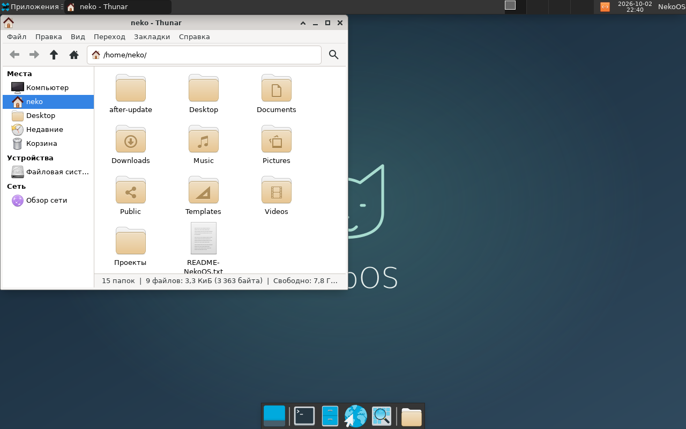

# Проверка управляемого обновления NekoOS — 2026-10-02

Статус: **пройдено в QEMU**. 79 unit-тестов, проверки Bash и синтаксиса
двух Windows-пускателей прошли. Полный сценарий QEMU завершился дважды;
итоговый запуск проверял неизменность контрольных сумм исходников в течение
теста. Проверены успешное обновление, отказ сети, прерывание настоящей
установки и восстановление с текущими пользовательскими файлами.

## Конфигурация

- Native Linux filesystem Ubuntu WSL на F:, обычный пользователь `neko`.
- QEMU q35/KVM, CPU host, 2 vCPU, 2048 МиБ RAM, virtio-blk/network/VGA,
  USB keyboard/tablet; BIOS SeaBIOS и UEFI OVMF без Secure Boot.
- Источник — проверенный GPT-шаблон 12 ГиБ, 471 подписанный пакет Arch
  из снимка 2026/09/29. QA использует временные самостоятельные копии;
  пользовательская VM и её данные не подключаются к этому тесту.
- HOME — отдельный ext4 raw-диск 8 ГиБ; staging получает его частную
  qcow2-копию. Постоянные поколения — независимые qcow2 без backing-файлов.
- Testing-кандидат — 2026/10/01. SHA-256 баз закреплены в
  `arch/releases/testing.json`, подписи пакетов обязательны.

## Фактическое обновление

Pacman выполнил полный `-Syu`. Изменилось **11 пакетов**, загрузка —
**157,38 МиБ**. Версии из списка транзакции:

| Пакет | Версия кандидата |
| --- | --- |
| firefox / firefox-i18n-ru | 157.0-1 |
| gdb / gdb-common | 18.1-1 |
| libpng | 1.6.59-1 |
| llvm-libs | 23.1.1-1 |
| mesa | 1:26.2.3-2 |
| openssl | 3.6.5-1 |
| pam | 1.7.3-1 |
| pcre2 | 10.49-1 |
| tzdata | 2026e-1 |

Работающее ядро до и после — **7.2.7-arch1-1**: данный снимок ядро
не меняет. Сверены работающий kernel и каталог установленного пакета linux.
Пересоздание initramfs и GRUB прошло. SHA-256 полного вывода `pacman -Q`:

- исходный: `851f00bef00610d7694cc7d50c1f8c7b55c39301ce7756b7c189580de7a96473`;
- новый: `5eb49b45f96077f0c430f9372c9507c1ad9ab2d9b767e934332d1102bb7cd1a6`.

Это доказательство настоящего изменения набора пакетов, а не только
переключения метаданных. При откате проверены исходный пакетный набор
и работающее ядро. Смена версии самого ядра остаётся отдельным
регрессионным сценарием для следующего снимка, который содержит такую смену.

## Сценарии QEMU

Десять запусков в итоговом тесте:

1. Импорт HOME: stop LightDM, rsync с владельцами, ACL и xattrs,
   checksum dry-run, подключение HOME по UUID в fstab и штатное выключение.
2. Повторная BIOS-загрузка: HOME смонтирован отдельно, системный и desktop
   smoke-тесты, штатное выключение.
3. Создание контрольного русского файла, проверка владельца и SHA-256.
4. Staging без сетевого устройства: операция отклонена именно из-за
   отсутствия маршрута. SHA-256 активного корня и настоящего HOME не изменены.
5. Staging с сетью: подписанные пакеты скачаны и проверены; QEMU остановлена
   после первого ALPM upgraded-события. В логе есть завершение установки
   tzdata и начало openssl, затем `NEKO_UPDATE_TRANSACTION_ACTIVE`.
   Кандидат failed, активный корень и настоящий HOME побайтно неизменны.
6. Новая успешная подготовка полного обновления и штатное выключение.
7. BIOS-проверка обновлённого desktop, GCC, HTTPS и ядра.
8. UEFI-проверка обновлённого desktop; после выключения кандидат sealed/ready.
9. Включение кандидата: прежний файл цел, реальные события клавиатуры QMP
   создают `after-update` через Thunar; в каталог записан русский файл.
   Затем VM штатно выключена.
10. Откат и UEFI-загрузка проверили оба файла, их владельцев и исходные
    пакеты; VM штатно выключена.

Все VM, кроме намеренно прерванной, выключены
штатно. BIOS/UEFI-проверки включают видимые панели Xfce, фон desktop,
менеджер окон, Thunar, sudo, glibc/systemd, C-программу GCC и HTTPS.
Firefox проверен по установленной версии; изменение формата его личного
профиля при возврате на старый Firefox этим тестом не проверялось.

Данные контрольных файлов — UTF-8; их SHA-256:
`92fd501fc1f6e70aa423f3f53afbb945c8c21bb9af2e3ccbf0a6ddbb99cfcca1`.
Байтовые суммы активного корня и HOME после двух сбоев, исходники,
версия ядра и пакетные суммы — в [машинном отчёте](validation/managed-update-2026-10-02.json).



## Unit-проверки и пределы результата

14 новых тестов управления проверяют недопустимые описания выпуска,
переключение и обратное переключение без записи в HOME, отказ атомарной
записи, повреждённые поколения, отсутствие seal/facts, нехватку места
до создания кандидата, сбой копирования и явное удаление неполной копии,
симлинки/hardlinks, внешние backing-файлы, небезопасные ссылки на поколения,
ограничение накопления дисков и одновременное управление.
Нехватка места и сбой записи здесь симулированы unit-тестами; это не
утверждение о проведённом полном QEMU-тесте заполненного хранилища.

Отчёт относится к прототипу VM/testing. Stable-выпуск, подписанный
каталог NekoOS, несколько зеркал, автооткат после неудачной загрузки,
физическое оборудование и миграции форматов всех приложений не проверены.
Live ISO в этом этапе не пересобирался; его ранее проверенные артефакты
и [отчёт](validation-live-iso-2026-10-01.md) относятся к прежнему профилю.
Системные компоненты после обновления остаются официальными пакетами Arch;
NekoOS добавляет свой цикл staging, проверки, включения и восстановления.

## Подготовленная локальная VM

После QA отдельно выполнен Windows-пускатель `Manage-NekoOS.ps1`:
`init`, `prepare`, `activate`. Исходная пользовательская Arch VM
импортирована на копию с проверкой HOME; кандидат 2026/10/01 включён,
предыдущий корень удерживается. После включения прошла дополнительная
UEFI-загрузка с перенесённым настоящим HOME и desktop smoke-тестом.
VM штатно выключена и готова к `Start-NekoOS.ps1 -Managed`.

Старый `system.qcow2` побайтно не изменился: SHA-256 до/после
`edb19d78851cd7cffcbf8d1f56f027b51eefbb7193e47906ef4ac21a71df6294`.
Результат — в [локальном машинном отчёте](validation/managed-user-2026-10-02.json).
Каталог новой VM занимает около **6,7 ГиБ** физически, включая два
системных поколения и разреженный HOME; виртуальная ёмкость HOME — 8 ГиБ.
Все эти файлы находятся внутри WSL на F:. Временные QA-диски удалены.

## Воспроизведение

Из native Linux-копии:

```bash
python3 -m unittest discover -s tests -v
bash os arch update test
```

Из Windows: `Manage-NekoOS.ps1 -Action test`. Актуальный итог и логи
сохраняются в `build/logs/`; JSON помечается running до начала теста,
passed записывается только после всех проверок. Временные QA-диски удаляются.
Команды для повседневного запуска — в [инструкции](managed-updates.md).
